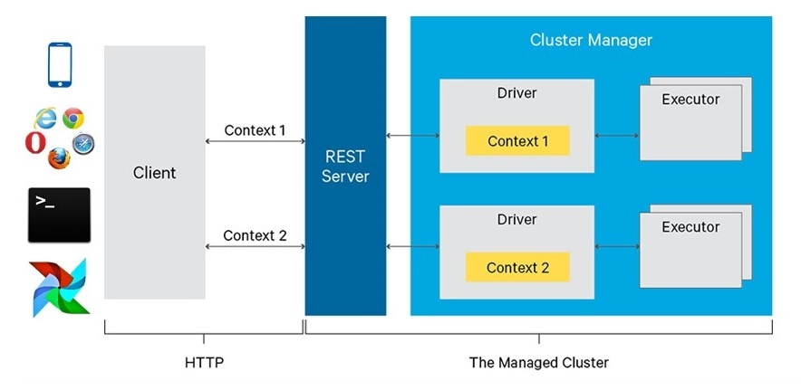
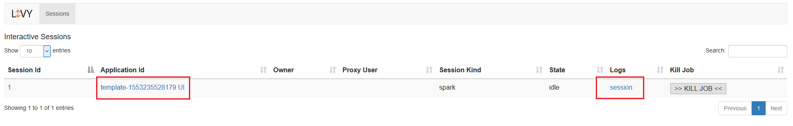
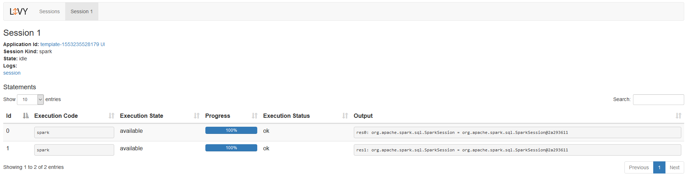
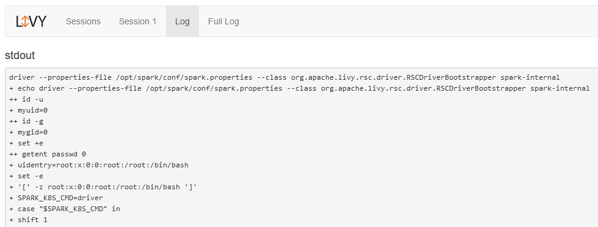
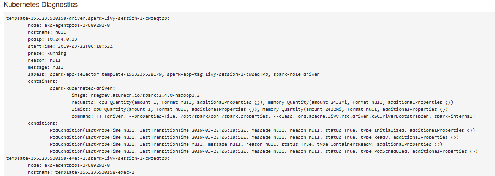
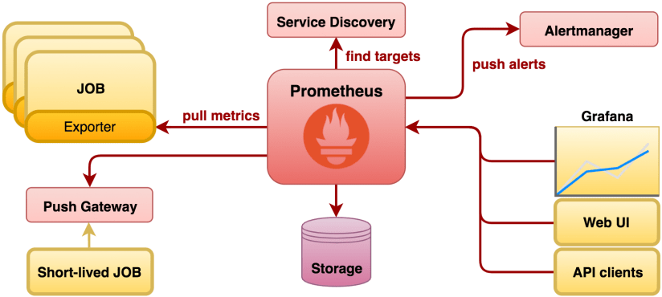
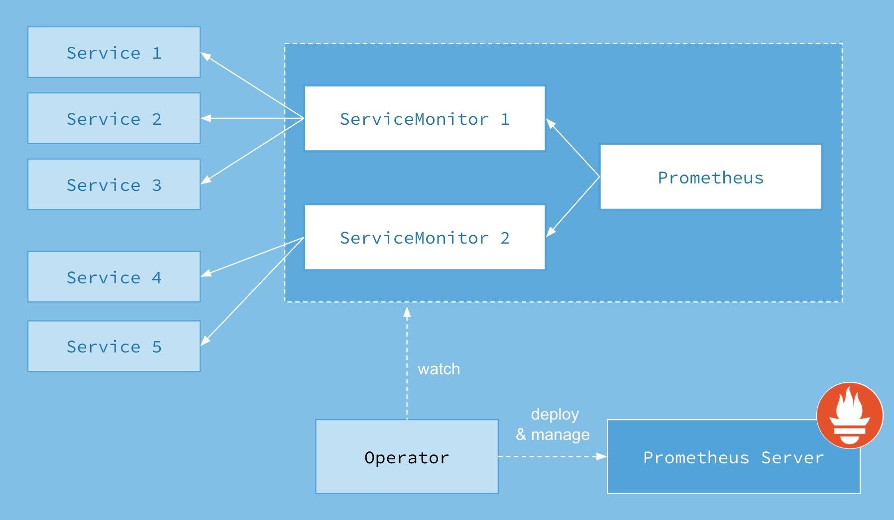
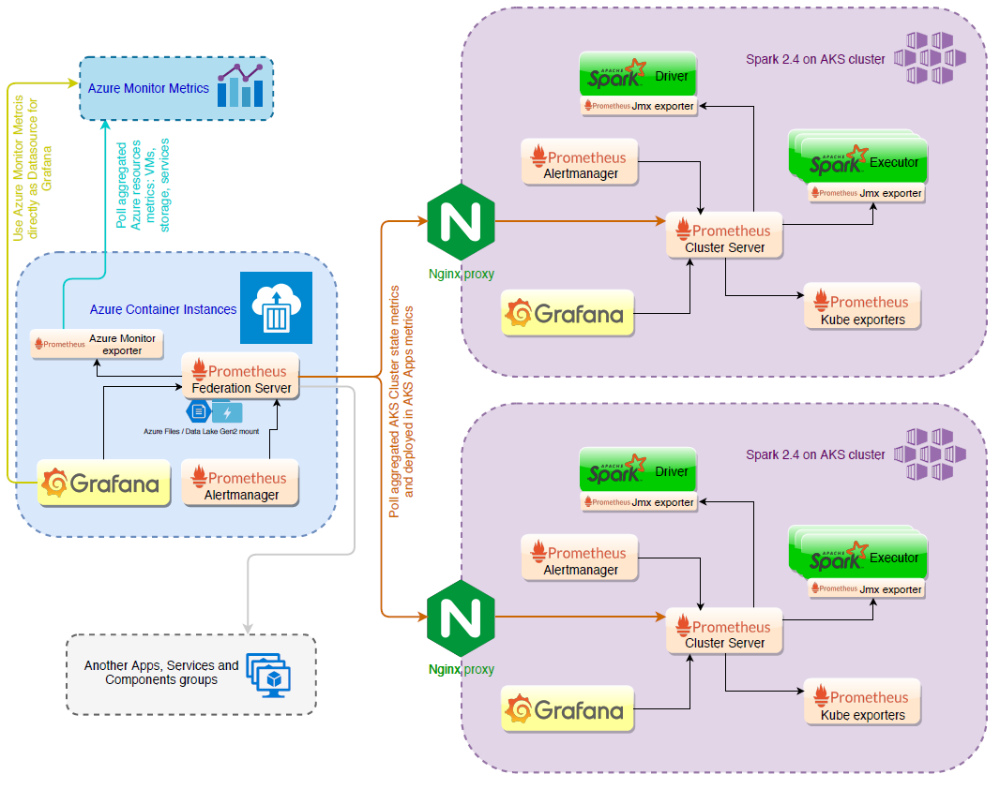

[](https://circleci.com/gh/jahstreet/spark-on-kubernetes-helm)
# spark-on-kubernetes-helm
Spark on Kubernetes infrastructure Helm charts repo 

# Spark on Kubernetes Platform Design concept

Contents:
- [Motivation and benefits](#motivation-and-benefits)
- [Design concept](#design-concept)
- [Installation guide]()
- [Known issues and tips]()

Refs:
- [[LIVY-588][WIP]: Full support for Spark on Kubernetes](https://github.com/apache/incubator-livy/pull/167)
- [Jupyter Sparkmagic kernel to integrate with Apache Livy](https://github.com/jupyter-incubator/sparkmagic)
- [Spark Summit 2016, Cloudera and Microsoft, Livy concepts and motivation](https://www.youtube.com/watch?v=C_3iEf_KNv8&t=836s)
- [PyData 2018, London, JupyterHub from the Ground Up with Kubernetes - Camilla Montonen](https://www.youtube.com/watch?v=rVOLdTE5bg0)
- [End to end monitoring with the Prometheus Operator](https://www.youtube.com/watch?v=5Jr1v9mWnJc)
- [Grafana Loki: Like Prometheus, But for logs. - Tom Wilkie, Grafana Labs](https://www.youtube.com/watch?v=CQiawXlgabQ)
- [NGINX conf 2018, Using NGINX as a Kubernetes Ingress Controller](https://www.youtube.com/watch?v=AXZr2OC8Unc)

### Motivation and benefits

Running [Spark on Kubernetes](https://spark.apache.org/docs/latest/running-on-kubernetes.html) is available since Spark 2.3.0 release on February 28, 2018. Now it is 2.4.3 and still lacks much comparing to the well known Yarn setups on Hadoop-like clusters.

Corresponding to the official [docs](https://spark.apache.org/docs/latest/running-on-kubernetes.html) user is able to run Spark on Kubernetes via [`spark-submit` CLI script](https://spark.apache.org/docs/latest/running-on-kubernetes.html#cluster-mode). And actually it is the only in-built into Apache Spark Kubernetes related capability along with some [config options](https://spark.apache.org/docs/latest/running-on-kubernetes.html#spark-properties). [Debugging proposal](https://spark.apache.org/docs/latest/running-on-kubernetes.html#introspection-and-debugging) from Apache docs is too poor to use it easily and available only for console based tools. Schedulers integration is not available either, which makes it too tricky to setup convenient pipelines with Spark on Kubernetes out of the box. Yarn based Hadoop clusters in turn has all the UIs, Proxies, Schedulers and APIs to make your life easier.

On the other hand the usage of Kubernetes clusters in opposite to Yarn ones has definite benefits (July 2019 comparison):

- <b>Pricing.</b> Comparing the similar cluster setups on Azure Cloud shows that [AKS](https://docs.microsoft.com/en-us/azure/aks/) is about 35% cheaper than [HDInsight Spark](https://docs.microsoft.com/en-us/azure/hdinsight/spark/apache-spark-overview).
- <b>Scaling.</b> Kubernetes cluster in Cloud support elastic autoscaling with many cool related features alongside, eg: Nodepools. Scaling of Hadoop clusters is far not as fast though, can be done either [manually](https://docs.microsoft.com/en-us/azure/hdinsight/hdinsight-scaling-best-practices?toc=https%3A%2F%2Fdocs.microsoft.com%2Fen-us%2Fazure%2Fhdinsight%2Fhadoop%2FTOC.json&bc=https%3A%2F%2Fdocs.microsoft.com%2Fen-us%2Fazure%2Fbread%2Ftoc.json) or [automatically](https://docs.microsoft.com/en-us/azure/hdinsight/hdinsight-autoscale-clusters) (on July 2019 was in preview).
- <b>Integrations.</b> You can run any workloads in Kubernetes cluster wrapped into the Docker container. But do you know anyone who has ever written Yarn App in the modern world?
- <b>Support.</b> You don't have a full control over the cluster setup provided by Cloud and usually there are no latest versions of software available for months after the release. With Kubernetes you can build image on your own.
- <b>Other Kuebernetes pros.</b> CI/CD with Helm, Monitoring stacks ready for use in-one-button-click, huge popularity and community support, good tooling and of course HYPE.

All that makes much sense to try to improve Spark on Kubernetes usability to take the whole advantage of modern Kubernetes setups in use.

### Design concept

The heart of all the problems solution is [Apache Livy](https://livy.incubator.apache.org/). Apache Livy is a service that enables easy interaction with a Spark cluster over a REST interface. It is supported by [Apache Incubator](https://incubator.apache.org/) community and [Azure HDInsight](https://docs.microsoft.com/en-us/azure/hdinsight/spark/apache-spark-livy-rest-interface) team, which uses it as a first class citizen in their Yarn cluster setup and does many integrations with it. Watch [Spark Summit 2016, Cloudera and Microsoft, Livy concepts and motivation](https://www.youtube.com/watch?v=C_3iEf_KNv8&t=836s) for the details.

The cons is that Livy is written for Yarn. But Yarn is just Yet Another resource manager with containers abstraction adaptable to the Kubernetes concepts. Livy is fully open-sourced as well, its codebase is RM aware enough to make Yet Another One implementation of it's interfaces to add Kubernetes support. So why not!? Check the [WIP PR](https://github.com/apache/incubator-livy/pull/167) with Kubernetes support proposal for Livy.

The high-level architecture of Livy on Kubernetes is the same as for Yarn.

<span style="display:block;text-align:center;max-width:640px"></span>

Livy server just wraps all the logic concerning interaction with Spark cluster and provides simple [REST interface](https://livy.incubator.apache.org/docs/latest/rest-api.html).

<details><summary><b>[EXPAND]</b> For example, to submit Spark Job to the cluster you just need to send `POST /batches` with JSON body containing Spark config options, mapped to `spark-submit` script analogous arguments.</summary>
<p>

```bash
$SPARK_HOME/bin/spark-submit \
    --master k8s://https://<k8s-apiserver-host>:<k8s-apiserver-port> \
    --deploy-mode cluster \
    --name spark-pi \
    --class org.apache.spark.examples.SparkPi \
    --conf spark.executor.instances=5 \
    --conf spark.kubernetes.container.image=<spark-image> \
    local:///path/to/examples.jar
 
# is equals to
 
curl -H 'Content-Type: application/json' -X POST \
  -d '{
        "name": "SparkPi",
        "className": "org.apache.spark.examples.SparkPi",
        "numExecutors": 5,
        "conf": {
          "spark.kubernetes.container.image": "<spark-image>"
        },
        "file": "local:///path/to/examples.jar"
      }' "http://livy.endpoint.com/batches"
```
</p></details>

Under the hood Livy parses POSTed configs and does `spark-submit` for you, bypassing other defaults configured for the Livy server, eg.: `--master k8s://https://<k8s-apiserver-host>:<k8s-apiserver-port>` value.

After the job submission Livy discovers Spark Driver Pod scheduled to the Kubernetes cluster with Kubernetes API and starts to track its state, cache Spark Pods logs and details descriptions making that information available through Livy REST API, builds routes to Spark UI, Spark History Server, Monitoring systems with [Kubernetes Ingress](https://kubernetes.io/docs/concepts/services-networking/ingress/) resources, [Nginx Ingress Controller](https://github.com/kubernetes/ingress-nginx) in particular and displays the links on Livy Web UI.

Providing REST interface for Spark Jobs orchestration Livy allows any number of integrations with Web/Mobile apps and services, easy way of setting up flows via jobs scheduling frameworks.

Livy has in-built lightweight Web UI, which makes it really competitive to Yarn in terms of navigation, debugging and cluster discovery.

<span style="display:block;text-align:center;max-width:640px"></span>
<span style="display:block;text-align:center;max-width:640px"></span>
<span style="display:block;text-align:center;max-width:640px"></span>
<span style="display:block;text-align:center;max-width:640px"></span>

Livy supports interactive sessions with Spark clusters allowing to communicate between Spark and application servers, thus enabling the use of Spark for interactive web/mobile applications. Using that feature Livy integrates with [Jupyter Notebook](https://jupyter.readthedocs.io/en/latest/) through [Sparkmagic kernel](https://github.com/jupyter-incubator/sparkmagic) out of box giving user elastic Spark exploratory environment in Scala and Python. Just deploy it to Kubernetes and use!

<span style="display:block;text-align:center;max-width:640px"></span>

On top of Jupyter it is possible to set up [JupyterHub](https://jupyterhub.readthedocs.io/en/stable/), which is a multi-user Hub that spawns, manages, and proxies multiple instances of the single-user Jupyter notebook servers. Follow the video [PyData 2018, London, JupyterHub from the Ground Up with Kubernetes - Camilla Montonen](https://www.youtube.com/watch?v=rVOLdTE5bg0) to learn the details of the implementation. JupyterHub provides a way to setup auth through Azure AD with [AzureAdOauthenticator plugin](https://github.com/jupyterhub/oauthenticator#azure-setup) as well as many other Oauthenticator plugins.

<span style="display:block;text-align:center;max-width:640px"></span>

Monitoring setup of Kubernetes cluster itself can be done with [Prometheus Operator](https://github.com/helm/charts/tree/master/stable/prometheus-operator) stack with [Prometheus Pushgateway](https://github.com/helm/charts/tree/master/stable/prometheus-pushgateway) and [Grafana Loki](https://github.com/grafana/loki/tree/master/production/helm) using a combined [Helm chart](https://github.com/jahstreet/spark-on-kubernetes-helm/tree/master/charts/spark-monitoring), which allows to do the work in one-button-click. Learn more about the stack from videos:
- [End to end monitoring with the Prometheus Operator](https://www.youtube.com/watch?v=5Jr1v9mWnJc)
- [Grafana Loki: Like Prometheus, But for logs. - Tom Wilkie, Grafana Labs](https://www.youtube.com/watch?v=CQiawXlgabQ)

The overall monitoring architecture solves pull and push model of metrics collection from the Kubernetes cluster and the services deployed to it. [Prometheus Alertmanager](https://prometheus.io/docs/alerting/alertmanager/) gives an interface to setup alerting system.

<span style="display:block;text-align:center;max-width:640px"></span>
<span style="display:block;text-align:center;max-width:640px"></span>

With the help of [JMX Exporter](https://github.com/prometheus/jmx_exporter) or [Pushgateway Sink](https://github.com/banzaicloud/spark-metrics/blob/master/PrometheusSink.md) we can get Spark metrics inside the monitoring system. [Grafana Loki](https://grafana.com/loki) provides out-of-box logs aggregation for all Pods in the cluster and natively integrates with [Grafana](https://grafana.com/). Using [Grafana Azure Monitor datasource](https://grafana.com/docs/features/datasources/azuremonitor/) and [Prometheus Federation](https://prometheus.io/docs/prometheus/latest/federation/) feature you can setup complex global monitoring architecture for your infrastructure.

<span style="display:block;text-align:center;max-width:640px"></span>

## Installation guide

TODO

## Known issues and tips

TODO
